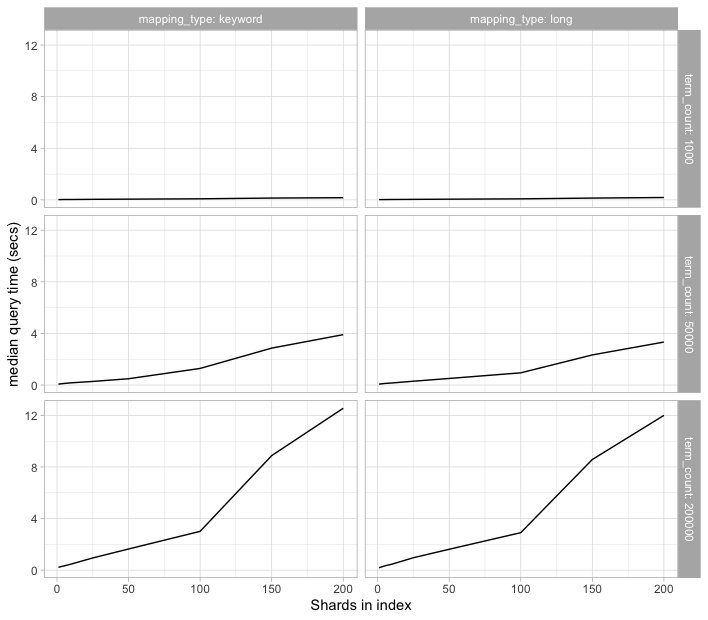

# Benchmarking Elasticsearch high term counts

This contains some benchmarks of how Elasticsearch handles a high number of term counts, even when it returns an error.

A [terms query](https://www.elastic.co/guide/en/elasticsearch/reference/current/query-dsl-terms-query.html) is a pretty common thing to do in Elasticsearch. It looks like:

```
GET /_search
{
  "query": {
    "terms": {
      "user.id": [ 
        12345,
        67890
      ]
    }
  }
}
```


There is a limit of [`index.max_terms_count`](https://www.elastic.co/guide/en/elasticsearch/reference/current/index-modules.html#index-max-terms-count) on how many terms you can include, which defaults to 65,536. Due to a bug in a production system, we were including 250,000 elements in this terms list. I would _expect_ this to return quickly with a 400 validation error. However, it was taking 16 seconds to return on our large production clusters. I made this repo to dig into the issue to determine what is going on.

## How I benchmarked

I used docker to run on my local laptop, so latency isn't meant to be what you'll see in production but to compare against other benchmarks. Elasticsearch runs with 1gb of heap on all configurations. All the indices where totally *empty*, zero documents, just a newly created index with the specificed number of shards. I used [hyperfine](https://github.com/sharkdp/hyperfine) to run the benchmarks. I used the latest Elasticsearch version 7.10.1.

## Single node, 200k term list

On a single node running locally in docker, a large term count returns relatively quickly in ~300ms. It takes the roughly the same time, regardless of the number of shards that the index has.

| Command | Mean [ms] | Min [ms] | Max [ms] | Relative |
|:---|---:|---:|---:|---:|
| `SHARD_COUNT=1 bash ./make_query.sh` | 352.3 ± 36.6 | 316.0 | 399.4 | 1.23 ± 0.14 |
| `SHARD_COUNT=5 bash ./make_query.sh` | 352.9 ± 53.0 | 292.5 | 412.6 | 1.24 ± 0.19 |
| `SHARD_COUNT=10 bash ./make_query.sh` | 330.6 ± 83.8 | 257.8 | 474.5 | 1.16 ± 0.30 |
| `SHARD_COUNT=25 bash ./make_query.sh` | 291.3 ± 22.6 | 263.8 | 323.2 | 1.02 ± 0.09 |
| `SHARD_COUNT=50 bash ./make_query.sh` | 302.9 ± 35.8 | 271.8 | 364.6 | 1.06 ± 0.13 |
| `SHARD_COUNT=100 bash ./make_query.sh` | 346.9 ± 102.2 | 277.9 | 527.9 | 1.22 ± 0.36 |
| `SHARD_COUNT=150 bash ./make_query.sh` | 285.3 ± 11.3 | 272.3 | 301.8 | 1.00 |
| `SHARD_COUNT=200 bash ./make_query.sh` | 299.4 ± 15.9 | 290.2 | 327.7 | 1.05 ± 0.07 |

## Three node cluster, 200k term list

On a three node cluster, we see vastly different behavior. Latency increases greatly as shard count increases, so much so that a 200 shard index takes 34 times longer to handle the request. Again, this is against an empty index and just returns an HTTP 400 validation error since it is above the max terms limit, but it still takes ~13 seconds to handle the request.

| Command | Mean [ms] | Min [ms] | Max [ms] | Relative |
|:---|---:|---:|---:|---:|
| `SHARD_COUNT=1 bash ./make_query.sh` | 393.2 ± 96.9 | 318.8 | 560.8 | 1.00 |
| `SHARD_COUNT=5 bash ./make_query.sh` | 500.3 ± 63.6 | 421.9 | 580.3 | 1.27 ± 0.35 |
| `SHARD_COUNT=10 bash ./make_query.sh` | 729.3 ± 107.9 | 603.1 | 871.1 | 1.86 ± 0.53 |
| `SHARD_COUNT=25 bash ./make_query.sh` | 1110.2 ± 83.0 | 1059.1 | 1255.5 | 2.82 ± 0.73 |
| `SHARD_COUNT=50 bash ./make_query.sh` | 1763.3 ± 110.9 | 1574.8 | 1868.9 | 4.49 ± 1.14 |
| `SHARD_COUNT=100 bash ./make_query.sh` | 3552.0 ± 148.6 | 3374.9 | 3785.6 | 9.03 ± 2.26 |
| `SHARD_COUNT=150 bash ./make_query.sh` | 10446.9 ± 485.8 | 9726.2 | 10856.2 | 26.57 ± 6.67 |
| `SHARD_COUNT=200 bash ./make_query.sh` | 13380.0 ± 326.5 | 13130.7 | 13933.6 | 34.03 ± 8.43 |

## Five node cluster, 200k term list

On a five node cluster, we see similar behavior to the three node cluster, but the queries degrade worse, topping out at ~25 seconds to handle the request and return an HTTP 400.

| Command | Mean [ms] | Min [ms] | Max [ms] | Relative |
|:---|---:|---:|---:|---:|
| `SHARD_COUNT=1 bash ./make_query.sh` | 366.0 ± 48.7 | 325.5 | 444.0 | 1.00 |
| `SHARD_COUNT=5 bash ./make_query.sh` | 535.2 ± 62.0 | 458.0 | 624.2 | 1.46 ± 0.26 |
| `SHARD_COUNT=10 bash ./make_query.sh` | 781.3 ± 46.4 | 700.4 | 815.7 | 2.14 ± 0.31 |
| `SHARD_COUNT=25 bash ./make_query.sh` | 1489.7 ± 132.1 | 1324.7 | 1652.0 | 4.07 ± 0.65 |
| `SHARD_COUNT=50 bash ./make_query.sh` | 2165.2 ± 113.5 | 2028.3 | 2333.3 | 5.92 ± 0.85 |
| `SHARD_COUNT=100 bash ./make_query.sh` | 4162.8 ± 139.9 | 4030.3 | 4360.1 | 11.38 ± 1.56 |
| `SHARD_COUNT=150 bash ./make_query.sh` | 18488.1 ± 1056.2 | 17372.4 | 19865.8 | 50.52 ± 7.32 |
| `SHARD_COUNT=200 bash ./make_query.sh` | 25321.6 ± 925.8 | 24325.1 | 26823.3 | 69.19 ± 9.56 |

## Full benchmark comparison between shard count, term count, and mapping type

To see if there was anything else interesting going on, I ran a benchmark that varied the shard count, terms count, and mapping type of the index field on a three node cluster. They all followed roughly the same path. I was mostly curious if the `keyword` vs `long` mapping type made any difference, but it didn't really matter in the end.



## Usage

Primary usage are through the `./run_single_benchmark.sh` and `./run_cluster_benchmark.sh` bash scripts. `docker`, `docker-compose`, and `hyperfine` are required to be installed.
